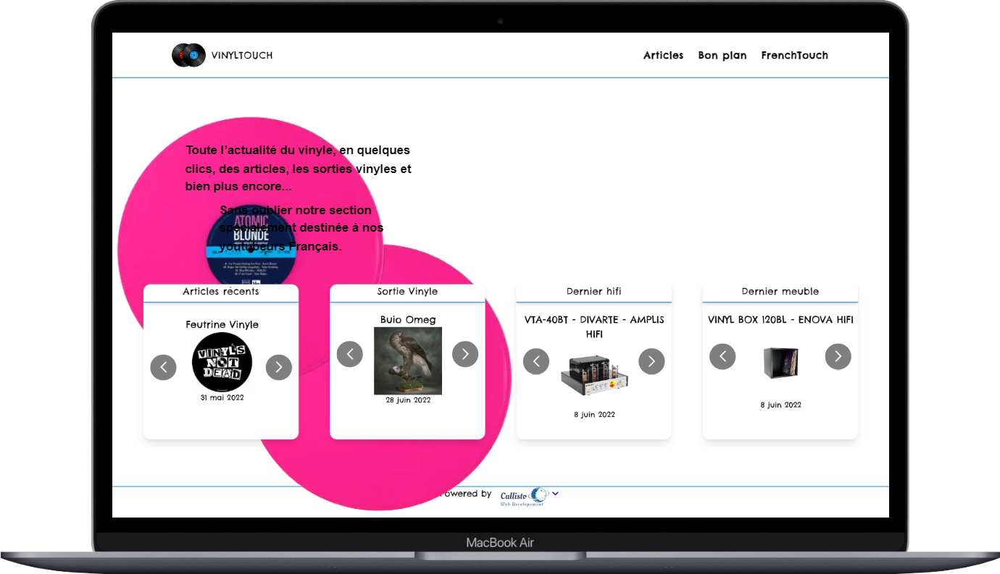

# React admin dashboard v1.0

This project was bootstrapped with [Create React App](https://github.com/facebook/create-react-app).

## Vinyl Touch Dashboard

<h1 align="center">
  
</h1>

## About

This repository is a dashboard application designed to add content to the Vinyltouch web application using the NestJS backend

  [API-NestJS](https://github.com/callisto28/Vinyl_NestJs_MongoDB).

## Technologies

This project was developed with the following technologies:

- [TypeScript](https://www.typescriptlang.org/)
- [React Navigation](https://reactnavigation.org/)
- [React JS](https://reactjs.org/)
- [Tailwind CSS](https://tailwindcss.com/)

